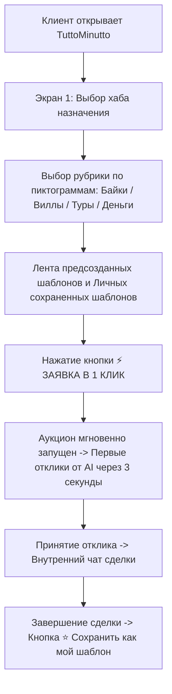

# 📁 04_USER_JOURNEYS_AND_FLOWS.md
> **TuttoMinutto** — Пользовательские сценарии (User Journeys) & JTBD  
> Версия: 3.0 | JTBD-Оптимизация пути заказчика + Персональные шаблоны 1-Click

---

## 1. JTBD Анализ Заказчика (Client Jobs To Be Done)

### Главная работа (Job Statement):
> *«Когда я прилетаю на курорт (Пхукет, Бали, Бангкок, Вьетнам), я хочу мгновенно получить нужную услугу (байк, жильё, обмен денег, массаж) по лучшей цене от проверенных исполнителей, потратив не более 1 минуты на выбор из шаблонов или повтор своего прошлым заказом.»*

---

## 2. Оптимизированный путь Клиента (Client Journey Map)

---

## 3. Функция «Сохранить как личный шаблон» (Save as Template)

### Сценарий использования:
1. **При создании любого заказа** или **в истории завершенной сделки** у клиента есть кнопка:
   `📌 Сохранить как мой шаблон`.
2. Заявка (категория, описание, условия, бюджет) сохраняется в личный кабинет в раздел **«⭐ Избранное & Мои шаблоны»**.
3. При следующем прилете на курорт или повторной потребности клиент просто заходит в Избранное и нажимает **`⚡ Повторить заказ в 1 клик`**.

---

## 4. Архитектура Главного Экрана Заказчика

1. **Верхняя панель профиля:** Имя, аватар, рейтинг `4.9 ★` и локация.
2. **Селектор хаба назначения (ASIAN HUBS):** `BALI`, `PHUKET`, `BANGKOK`, `VIETNAM`, `SEOUL`, `TOKYO`.
3. **Рубрикатор по пиктограммам:** `🏍️ RENTALS`, `⛵ TOURS`, `💱 EXCHANGE`, `🏡 VILLAS`, `💆 SPA`, `🛡️ SERVICES`.
4. **Лента готовых шаблонов:** Сочные карточки со стандартными и личными сохраненными шаблонами + кнопкой **`⚡ ЗАЯВКА В 1 КЛИК`**.
5. **Нижнее меню:**
   - 🏠 **Главная** (Каталог шаблонов услуг)
   - 📋 **Мои Заявки** (Активные аукционы и поступившие отклики)
   - ➕ **Свой Заказ** (Мастер произвольной заявки)
   - ⭐ **Избранное & Архив** (Сохраненные личные шаблоны и завершенные сделки)
   - 👤 **Профиль** (Настройки и реферальная программа 20%)
